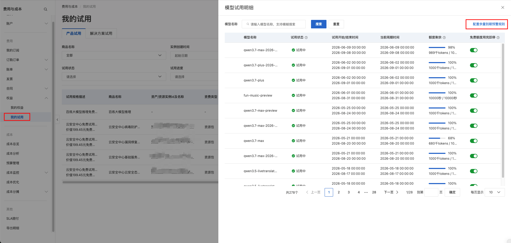
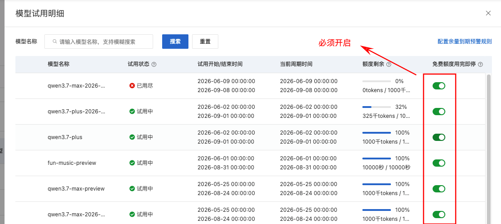
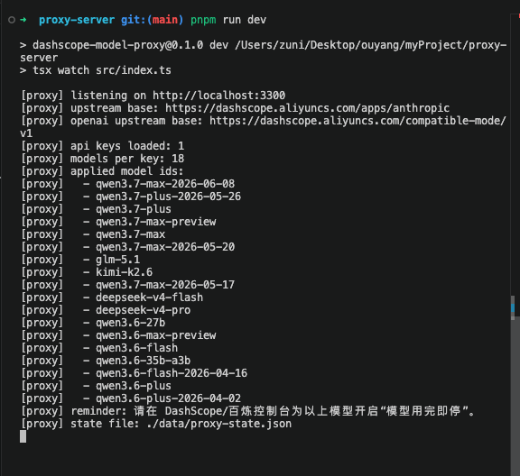

# 阿里云模型代理

基于 Hono.js 的反向代理服务，同时支持阿里云 DashScope Anthropic 兼容接口和 OpenAI 兼容接口。客户端只需一个代理地址和一个代理密钥，阿里云百炼大模型密钥和模型池均在服务端隐藏管理。当免费额度耗尽时，代理自动切换模型。

> 阿里云 DashScope 每个模型提供 **1000 万免费 tokens**，通过模型池聚合多个模型，可最大化利用免费额度。



## 功能

- 对外只暴露一个 API Key
- 隐藏阿里云百炼大模型密钥和模型池
- Anthropic 协议 `POST /v1/messages` 代理
- OpenAI Chat Completions 协议 `POST /v1/chat/completions` 代理
- OpenAI 协议 `GET /v1/models` 返回本地模型池列表
- 自动替换请求体中的 `model` 字段
- Key 优先故障转移：在当前 Key 下尝试所有可用模型，全部失败后才切换到下一个 Key
- 免费额度耗尽自动重试，触发条件（满足任意一组）：
  - HTTP `403`，`code` 为 `AccessDenied`，且 `message` 同时包含 `free tier` 和 `exhausted`
  - `code` 或 `type` 为 `AllocationQuota.FreeTierOnly`
- 冷却状态按 Key+模型组合持久化到 JSON 文件，重启不丢失
- 上游返回正常状态码后，流式响应直接透传，不做缓冲

## 模型池

> 截至 2026 年 6 月 11 日，以下模型均提供 **1000 万免费 tokens**，额度用完后代理自动切换至下一个可用模型，客户端无感知。
>
> 开通地址：[阿里云百炼控制台 - 模型试用](https://bailian.console.aliyun.com/)
>
> 活动地址：[Qwen3 免费额度活动](https://www.aliyun.com/benefit/client/qwen3)

**⚠️ 重要：必须开启"用完即停"**

在百炼控制台为每个模型开启**"用完即停"**（而非"用完转付费"）。如果不开启，额度用完后会自动转付费，代理无法检测到额度耗尽，切换机制将失效。



当前配置的模型 ID：

```text
qwen3.7-max-2026-06-08
qwen3.7-plus-2026-05-26
qwen3.7-plus
qwen3.7-max-preview
qwen3.7-max
qwen3.7-max-2026-05-20
glm-5.1
kimi-k2.6
qwen3.7-max-2026-05-17
deepseek-v4-flash
deepseek-v4-pro
qwen3.6-27b
qwen3.6-max-preview
qwen3.6-flash
qwen3.6-35b-a3b
qwen3.6-flash-2026-04-16
qwen3.6-plus
qwen3.6-plus-2026-04-02
```

**自动切换机制**

`DASHSCOPE_API_KEYS` 是你在阿里云百炼控制台申请的真实 API 密钥（可配置多个，逗号分隔）。代理会基于这些密钥和 `MODEL_IDS` 中的模型，自动进行两层轮换：

- **多模型轮换**：单个模型额度耗尽时，自动切换到同账号下的下一个模型
- **多账号兜底**：当前账号所有模型额度都用尽时，自动切换到下一个账号（即下一个 `DASHSCOPE_API_KEYS`）
- 所有切换过程对客户端透明，客户端只需使用 `PROXY_API_KEY` 访问即可，无需关心底层有多少个账号和模型

**数据安全**

- 真实 API Key 和调度状态均保存在本地，不上传任何服务器
- 状态文件仅存储 Key 哈希，不保存明文密钥

## 相关文档

- [使用说明](docs/usage.md)
- [状态文件说明](docs/state-file.md)

## 快速开始

```bash
pnpm install
cp .env.example .env
```

按需修改 `.env`：

```env
PORT=3300

PROXY_API_KEY=sk-001

DASHSCOPE_API_KEYS=sk-your-real-key-1,sk-your-real-key-2
UPSTREAM_BASE_URL=https://dashscope.aliyuncs.com/apps/anthropic
OPENAI_UPSTREAM_BASE_URL=https://dashscope.aliyuncs.com/compatible-mode/v1

MODEL_IDS=deepseek-v4-flash,deepseek-v4-pro,qwen3.7-max,qwen3.7-plus
MODEL_COOLDOWN_SECONDS=2592000
STATE_PATH=./data/proxy-state.json
UPSTREAM_AUTH_MODE=authorization
CORS_ORIGIN=*
```

开发模式：

```bash
pnpm dev
```



生产模式：

```bash
pnpm build
pnpm start
```

## 客户端调用

### Anthropic 协议

代理地址：

```text
http://localhost:3300
```

请求头二选一：

```http
Authorization: Bearer sk-001
```

或：

```http
x-api-key: sk-001
```

示例：

```bash
curl http://localhost:3300/v1/messages \
  -H "Authorization: Bearer sk-001" \
  -H "Content-Type: application/json" \
  -H "anthropic-version: 2023-06-01" \
  -d '{
    "model": "any-model-name",
    "max_tokens": 256,
    "messages": [
      {
        "role": "user",
        "content": "你好"
      }
    ]
  }'
```

### OpenAI 协议

代理 base URL：

```text
http://localhost:3300/v1
```

示例：

```bash
curl http://localhost:3300/v1/chat/completions \
  -H "Authorization: Bearer sk-001" \
  -H "Content-Type: application/json" \
  -d '{
    "model": "any-model-name",
    "messages": [
      {
        "role": "user",
        "content": "你好"
      }
    ],
    "stream": true
  }'
```

客户端可以使用 OpenAI SDK 接入 `http://localhost:3300/v1`。服务端本身只是反代，使用原生 `fetch`，不需要 `openai` SDK。

## 服务状态

健康检查：

```bash
curl http://localhost:3300/health
```

模型池状态：

```bash
curl http://localhost:3300/models/status \
  -H "Authorization: Bearer sk-001"
```

## Docker

```bash
docker build -t dashscope-model-proxy .
docker run --env-file .env -p 3300:3300 dashscope-model-proxy
```

## 社区支持

💬 欢迎到 [linux.do](https://linux.do) 交流、分享和反馈。

## 说明

冷却状态保存在 `STATE_PATH` 指定的 JSON 文件中，存储内容包括 Key 哈希、模型 ID、冷却截止时间、失败次数和最近错误信息，不保存明文阿里云百炼大模型密钥。

状态文件仅供单进程写入设计。若部署多实例，需各自维护独立状态文件或引入外部协调存储。

## 免责声明

本项目仅供学习和研究使用。使用本项目时，请遵守相关法律法规和服务提供商的使用条款。

- 本项目与阿里云、DashScope、Anthropic、OpenAI 等公司无任何关联
- 本项目不存储、不传输任何用户的 API 密钥或敏感数据，所有数据均保存在用户本地
- 使用本项目产生的任何费用、损失或法律责任，由使用者自行承担
- 本项目作者不对因使用本项目而导致的任何直接或间接损失负责
- 请确保您使用本项目的行为符合相关法律法规和服务提供商的使用条款

如果您发现本项目侵犯了您的权益，请联系作者进行处理。
